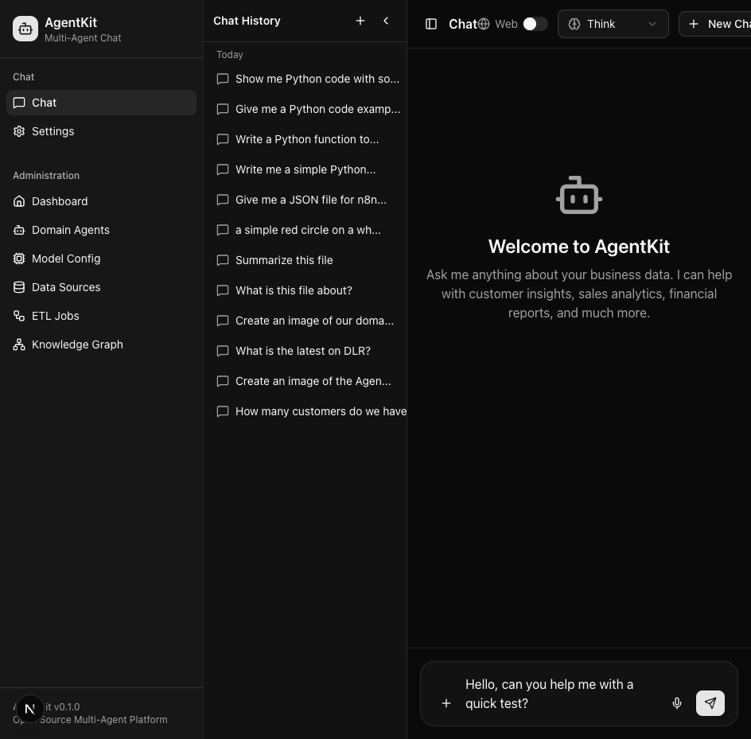
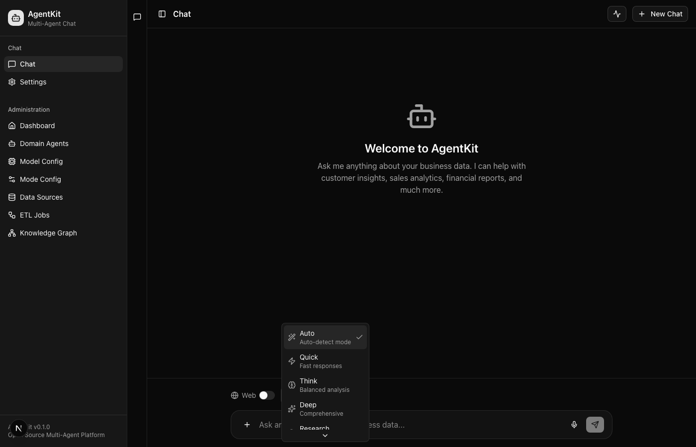
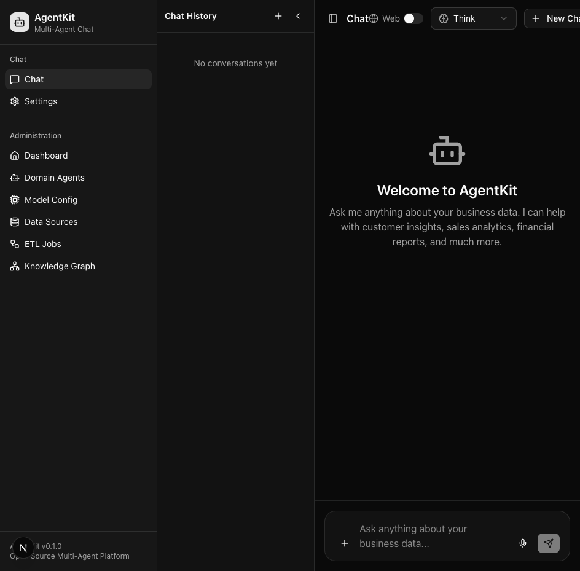
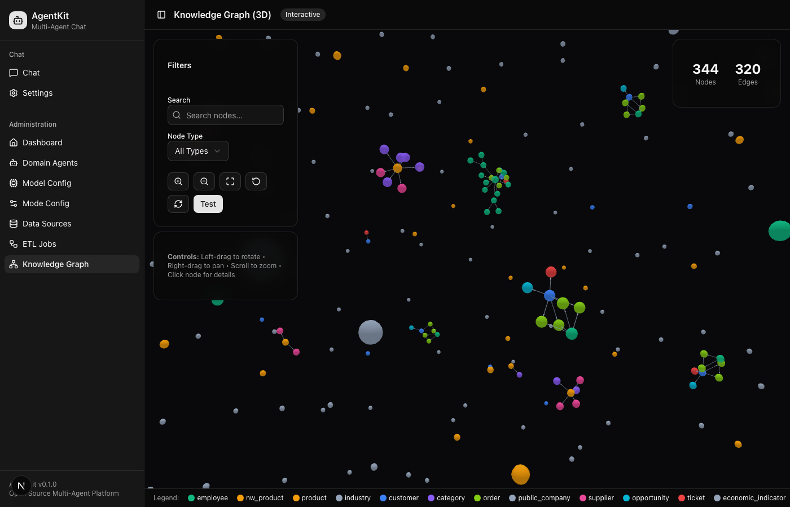
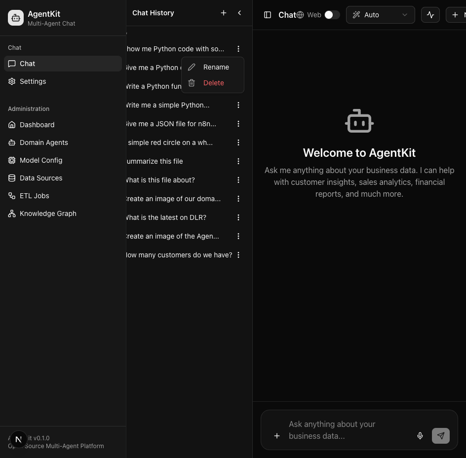
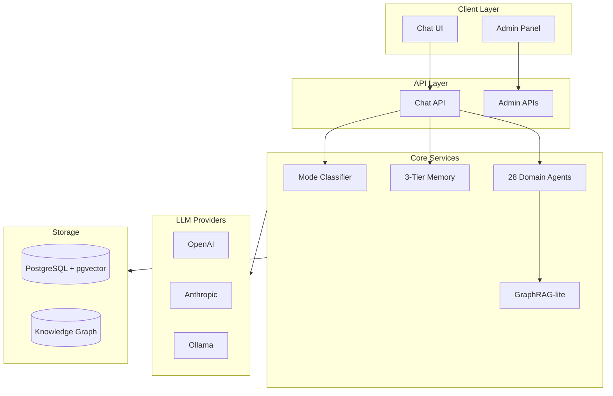
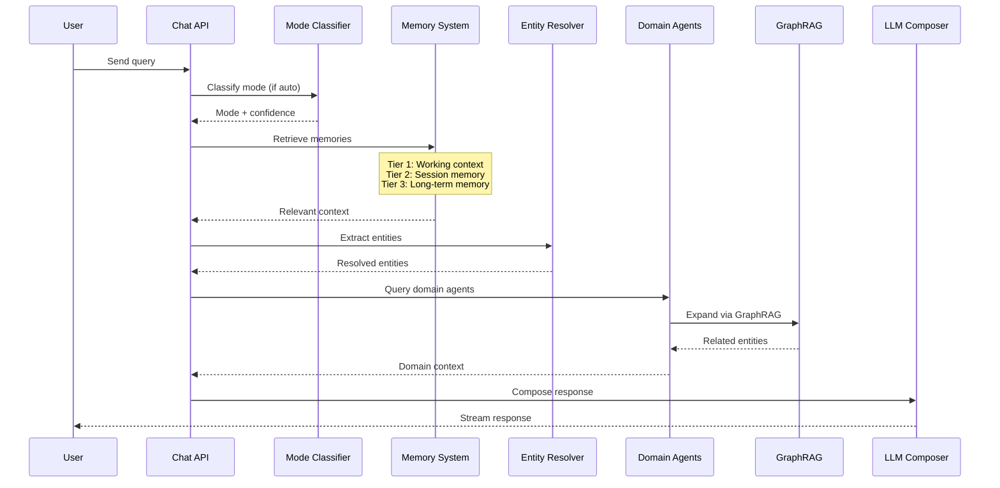
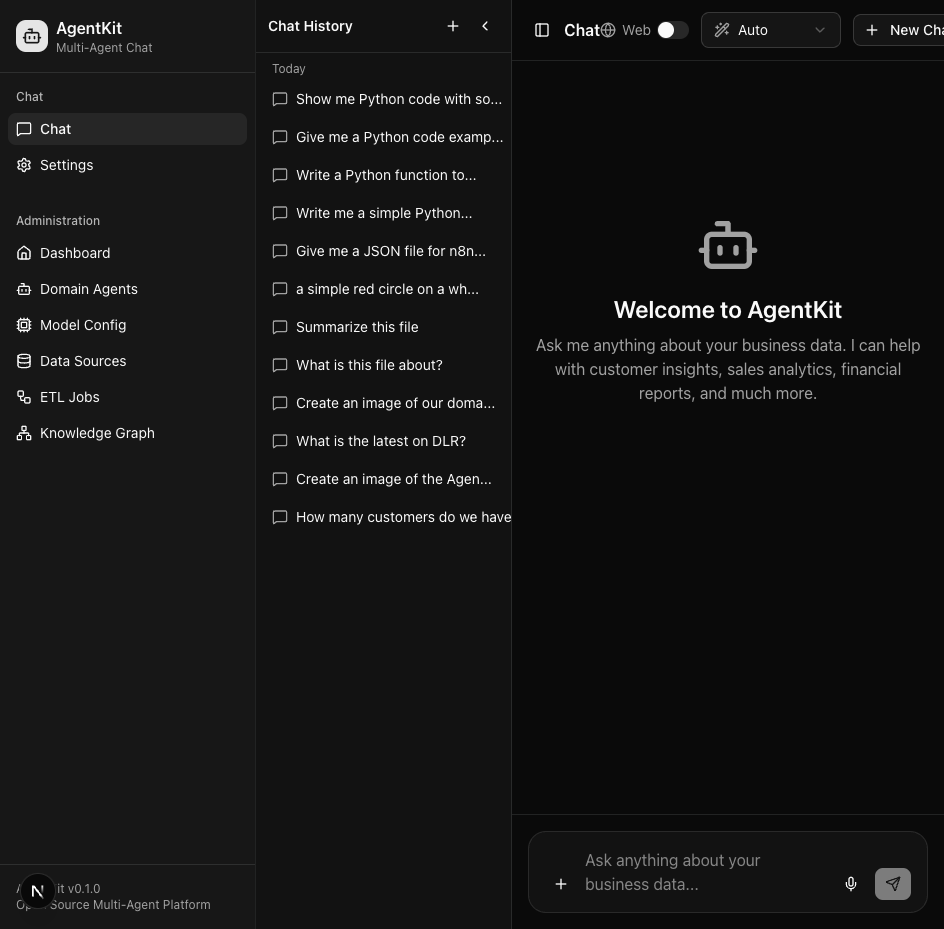
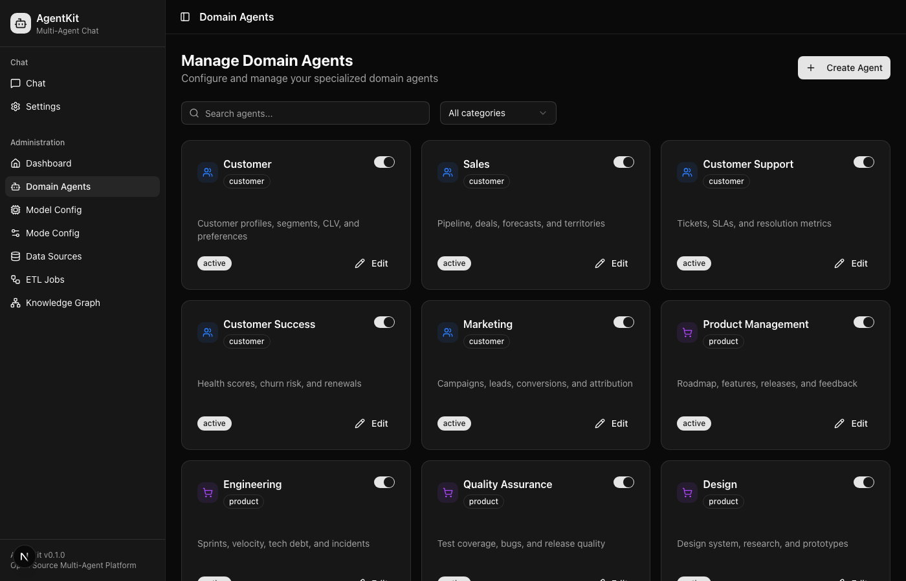
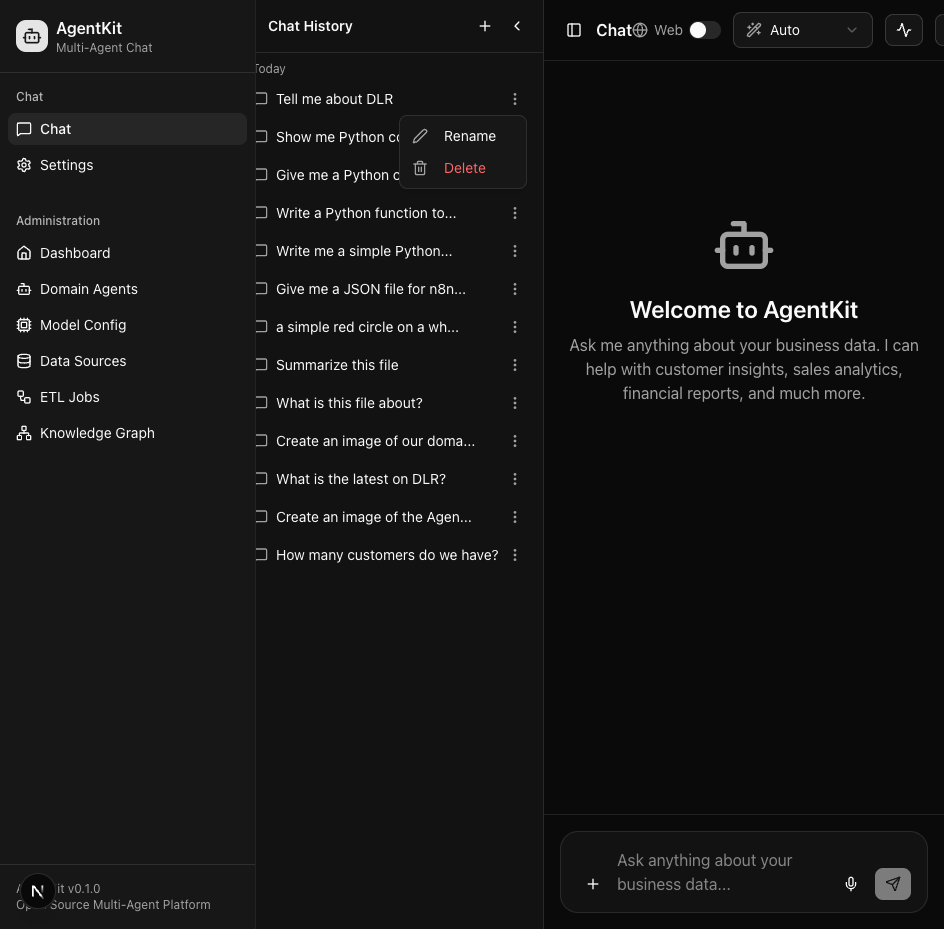

<p align="center">
  <h1 align="center">AgentKit</h1>
  <p align="center">
    An open-source, data-first multi-agent chat platform with configurable domain agents, multiple LLM provider support, and self-learning ETL pipelines.
  </p>
</p>

<p align="center">
  <a href="#features">Features</a> •
  <a href="#quick-start">Quick Start</a> •
  <a href="#architecture">Architecture</a> •
  <a href="#configuration">Configuration</a> •
  <a href="#customization">Customization</a> •
  <a href="#api-reference">API</a> •
  <a href="#contributing">Contributing</a>
</p>

<p align="center">
  
  
  
  
</p>

---

<p align="center">
  
</p>

## Overview

AgentKit is a production-ready multi-agent chat platform that enables intelligent conversations across your organization's data. It combines the power of modern LLMs with a sophisticated domain agent architecture to provide contextual, accurate responses grounded in your data.

**Key Capabilities:**

- **28 Pre-configured Domain Agents** covering all business functions
- **4 Chat Modes** (Quick, Think, Deep, Research) for different use cases
- **3-Tier Memory System** for personalized, context-aware conversations
- **GraphRAG-lite** for relationship discovery across your data
- **Multi-provider LLM Support** (OpenAI, Anthropic, Ollama)
- **Self-learning ETL Pipelines** with Plan-Act-Reflect pattern

---

## Features

### Multi-Agent Chat System

Query across 28 domain agents that understand your business data. Each agent specializes in a specific domain and can be customized with your own data sources.

<p align="center">
  
</p>

### Intelligent Mode Selection

| Mode | Best For | Speed | Depth |
|------|----------|-------|-------|
| **Quick** | Simple lookups, quick facts | Fast | Surface |
| **Think** | Analysis, insights | Balanced | Moderate |
| **Deep** | Comprehensive research | Thorough | Deep |
| **Research** | Complex investigations | Extended | Exhaustive |

### Domain Agent Coverage

<table>
<tr>
<td width="33%">

**Customer Domain**
- Customer Intelligence
- Sales Pipeline
- Customer Support
- Customer Success
- Marketing Analytics

</td>
<td width="33%">

**Product & Engineering**
- Product Management
- Engineering
- Quality Assurance
- Design
- Data Analytics

</td>
<td width="33%">

**Operations**
- Operations
- Supply Chain
- Inventory
- Procurement
- Facilities

</td>
</tr>
<tr>
<td>

**Finance & Legal**
- Finance
- Accounting
- Legal
- Compliance
- Risk Management

</td>
<td>

**People**
- Human Resources
- Talent Acquisition
- Learning & Development
- IT Support
- Communications

</td>
<td>

**Intelligence**
- Competitive Intelligence
- Business Intelligence
- Strategic Planning

</td>
</tr>
</table>

### Admin Dashboard

Manage agents, configure models, visualize your knowledge graph, and monitor ETL pipelines—all from a unified admin interface.

<p align="center">
  
</p>

### Knowledge Graph Visualization

Explore entity relationships with an interactive 3D knowledge graph.

<p align="center">
  
</p>

### ETL Pipeline Management

Self-learning pipelines with Plan-Act-Reflect (PAR) loop for reliable data ingestion.

<p align="center">
  
</p>

---

## Quick Start

### Prerequisites

- **Node.js** 18+ 
- **Docker** and Docker Compose
- **API Key** from OpenAI, Anthropic, or local Ollama installation

### Installation

1. **Clone the repository**

   ```bash
   git clone https://github.com/your-org/agentkit.git
   cd agentkit
   ```

2. **Install dependencies**

   ```bash
   npm install
   ```

3. **Start the database**

   ```bash
   cd docker
   docker compose up -d
   cd ..
   ```

   This starts PostgreSQL 16 with pgvector extension on port 5433.

4. **Configure environment**

   ```bash
   cp .env.example .env.local
   ```

   Edit `.env.local` and add your API keys:

   ```env
   # Required: At least one LLM provider
   OPENAI_API_KEY=sk-your-openai-key
   
   # Optional: Additional providers
   ANTHROPIC_API_KEY=sk-ant-your-anthropic-key
   OLLAMA_BASE_URL=http://localhost:11434
   ```

5. **Start the development server**

   ```bash
   npm run dev
   ```

6. **Open the app**

   Navigate to [http://localhost:3000](http://localhost:3000)

### First Run

On first launch, AgentKit will:
- Initialize the database schema
- Create 28 default domain agents
- Set up sample data for demonstration

You can start chatting immediately or configure your own data sources through the Admin panel at `/admin`.

---

## Architecture

AgentKit uses a layered architecture designed for extensibility and performance.

### High-Level Overview



### Request Flow



### Project Structure

```
agentkit/
├── src/
│   ├── app/                    # Next.js App Router
│   │   ├── (chat)/             # Chat interface routes
│   │   ├── admin/              # Admin dashboard
│   │   │   ├── agents/         # Agent management
│   │   │   ├── models/         # Model configuration
│   │   │   ├── graph/          # Knowledge graph viewer
│   │   │   └── etl/            # ETL pipeline management
│   │   └── api/                # REST API endpoints
│   │       ├── chat/           # Chat endpoint (SSE streaming)
│   │       ├── agents/         # Agent CRUD
│   │       ├── etl/            # ETL operations
│   │       └── graph/          # Knowledge graph APIs
│   ├── lib/
│   │   ├── chat/               # Chat orchestration
│   │   │   ├── mode-classifier.ts
│   │   │   ├── mode-config.ts
│   │   │   └── orchestrator.ts
│   │   ├── llm/                # LLM provider abstraction
│   │   │   └── providers/      # OpenAI, Anthropic, Ollama
│   │   ├── memory/             # 3-tier memory system
│   │   ├── retrieval/          # Domain retrieval
│   │   ├── graph/              # GraphRAG-lite
│   │   ├── semantic/           # Entity resolution
│   │   └── etl/                # ETL pipeline system
│   └── components/             # React UI components
├── docker/                     # Docker configuration
├── docs/                       # Documentation
└── tests/                      # Test suites
```

For detailed architecture documentation, see [docs/architecture.md](docs/architecture.md).

---

## Configuration

### Environment Variables

| Variable | Required | Description |
|----------|----------|-------------|
| `DATABASE_URL` | Yes | PostgreSQL connection string |
| `OPENAI_API_KEY` | One required | OpenAI API key |
| `ANTHROPIC_API_KEY` | One required | Anthropic API key |
| `OLLAMA_BASE_URL` | One required | Ollama server URL |
| `DEFAULT_LLM_PROVIDER` | No | Default provider: `openai`, `anthropic`, or `ollama` |
| `BRAVE_API_KEY_AI_GROUNDING` | No | Brave Search API key for web search |
| `AZURE_SEARCH_ENDPOINT` | No | Azure Cognitive Search endpoint |
| `AZURE_SEARCH_API_KEY` | No | Azure Search API key |

### Model Configuration

Configure which models are used for each role via the Admin UI at `/admin/models`:

| Role | Purpose | Default Model |
|------|---------|---------------|
| `composer` | Main response generation | gpt-5.2 |
| `composer_fast` | Quick mode responses | gpt-5-mini |
| `research` | Research mode (extended) | o3-deep-research |
| `planner` | Query planning | gpt-5-mini |
| `reflection` | Response improvement | gpt-5.2 |
| `mode_classifier` | Auto mode detection | gpt-5-mini |
| `memory_extractor` | Memory fact extraction | gpt-5-mini |
| `embeddings` | Vector embeddings | text-embedding-3-large |
| `image_generation` | Image creation | gpt-image-1.5 |

<p align="center">
  
</p>

### Chat Mode Configuration

Each mode has configurable parameters that can be customized per-user:

| Parameter | Quick | Think | Deep | Research |
|-----------|-------|-------|------|----------|
| Max Results | 5 | 15 | 30 | 50 |
| Graph Hops | 0 | 1 | 2 | 3 |
| Memory Tiers | 1 | 1-2 | 1-3 | 1-3 |
| Reflection | No | Yes | Yes | Yes |
| Clarification | No | No | No | Yes |

---

## Customization

### Adding Domain Agents

Create new domain agents without code changes via the Admin UI or REST API.

**Via Admin UI:**

1. Navigate to `/admin/agents`
2. Click "Create Agent"
3. Configure name, description, category, and system prompt
4. Link data sources

<p align="center">
  
</p>

**Via REST API:**

```bash
curl -X POST http://localhost:3000/api/agents \
  -H "Content-Type: application/json" \
  -d '{
    "name": "sustainability",
    "displayName": "Sustainability",
    "description": "Environmental metrics and ESG data",
    "category": "operations",
    "status": "active",
    "systemPrompt": "You are a sustainability specialist..."
  }'
```

### Connecting Data Sources

1. Navigate to `/admin/data`
2. Add data sources (database tables, APIs, files)
3. Link to domain agents via the agent configuration

Supported data sources:
- PostgreSQL tables/views
- CSV/JSON files
- REST APIs
- Document uploads (PDF, DOCX, XLSX)

### Creating ETL Pipelines

1. Navigate to `/admin/etl`
2. Create a new job with source configuration
3. Configure the PAR loop stages:
   - **Plan**: Analyze source, determine extraction strategy
   - **Act**: Execute extraction and transformation
   - **Reflect**: Evaluate results, learn from errors

---

## API Reference

### Core Endpoints

| Method | Endpoint | Description |
|--------|----------|-------------|
| `POST` | `/api/chat` | Main chat endpoint (SSE streaming) |
| `GET` | `/api/sessions` | List chat sessions |
| `POST` | `/api/sessions` | Create new session |
| `GET` | `/api/agents` | List domain agents |
| `POST` | `/api/agents` | Create domain agent |
| `GET` | `/api/graph/data` | Get knowledge graph data |
| `POST` | `/api/graph/build` | Build/rebuild knowledge graph |
| `GET` | `/api/etl/jobs` | List ETL jobs |
| `POST` | `/api/etl/jobs/{id}/run` | Execute ETL job |

### Chat Request

```typescript
POST /api/chat
Content-Type: application/json

{
  "message": "What are our top customers by revenue?",
  "sessionId": "session-uuid",
  "mode": "think",              // auto | quick | think | deep | research
  "webSearchEnabled": false,
  "memoryEnabled": true
}
```

### Chat Response (SSE)

The chat endpoint returns Server-Sent Events with the following event types:

```typescript
// Content chunks
event: content
data: {"content": "Based on the data..."}

// Agent events (for tracing)
event: agent_event  
data: {"type": "domain_agent_started", "domain": "customer"}

// Completion
event: done
data: {"messageId": "msg-uuid", "turnId": "turn-uuid"}
```

For complete API documentation, see the [API Reference](docs/api-reference.md).

---

## Reasoning & Evaluation

### Reasoning Pane

Enable the reasoning pane to see how AgentKit processes your query:

<p align="center">
  
</p>

The pane shows:
- Mode classification decisions
- Domain agent activations
- Memory retrieval
- GraphRAG traversal
- Quality evaluation scores

### Quality Evaluation

Each response is automatically evaluated on:
- **Relevance**: How well the response addresses the query
- **Groundedness**: Whether claims are supported by retrieved data
- **Coherence**: Logical flow and clarity
- **Completeness**: Coverage of the query scope

---

## Memory System

AgentKit implements a MemGPT-inspired 3-tier memory system:

### Tier 1: Working Context
- Recent conversation turns (last 3 exchanges)
- Session summary (if enabled)
- Always included in every request

### Tier 2: Session Memory
- Relevant past turns from current session
- Session facts extracted by the memory extractor
- Retrieved via vector similarity search

### Tier 3: Long-term Memory
- User profile facts across sessions
- Saved memories (explicit user saves)
- Cross-session knowledge

Configure memory behavior in Settings → Memory Configuration.

---

## Technology Stack

- **Frontend**: Next.js 16, React 19, Tailwind CSS 4, shadcn/ui
- **Backend**: Next.js API Routes, Node.js
- **Database**: PostgreSQL 16 with pgvector
- **ORM**: Drizzle ORM
- **LLM Providers**: OpenAI, Anthropic, Ollama
- **Search**: Brave Search, Azure Cognitive Search
- **Visualization**: react-force-graph, Three.js

---

## Development

### Running Tests

```bash
# Unit tests
npm run test

# Watch mode
npm run test:watch

# Coverage report
npm run test:coverage
```

### Database Migrations

```bash
# Generate migration from schema changes
npm run db:generate

# Apply migrations
npm run db:migrate
```

### Building for Production

```bash
npm run build
npm start
```

---

## Contributing

We welcome contributions! Please see [CONTRIBUTING.md](docs/CONTRIBUTING.md) for guidelines on:

- Setting up your development environment
- Code style and conventions
- Pull request process
- Testing requirements

---

## License

This project is licensed under the MIT License - see the [LICENSE](LICENSE) file for details.

---

## Acknowledgments

Built with:
- [Next.js](https://nextjs.org/) - React framework
- [shadcn/ui](https://ui.shadcn.com/) - UI components
- [PostgreSQL](https://www.postgresql.org/) - Database
- [pgvector](https://github.com/pgvector/pgvector) - Vector similarity search
- [Drizzle ORM](https://orm.drizzle.team/) - TypeScript ORM

---

<p align="center">
  Made with care for the developer community
</p>
